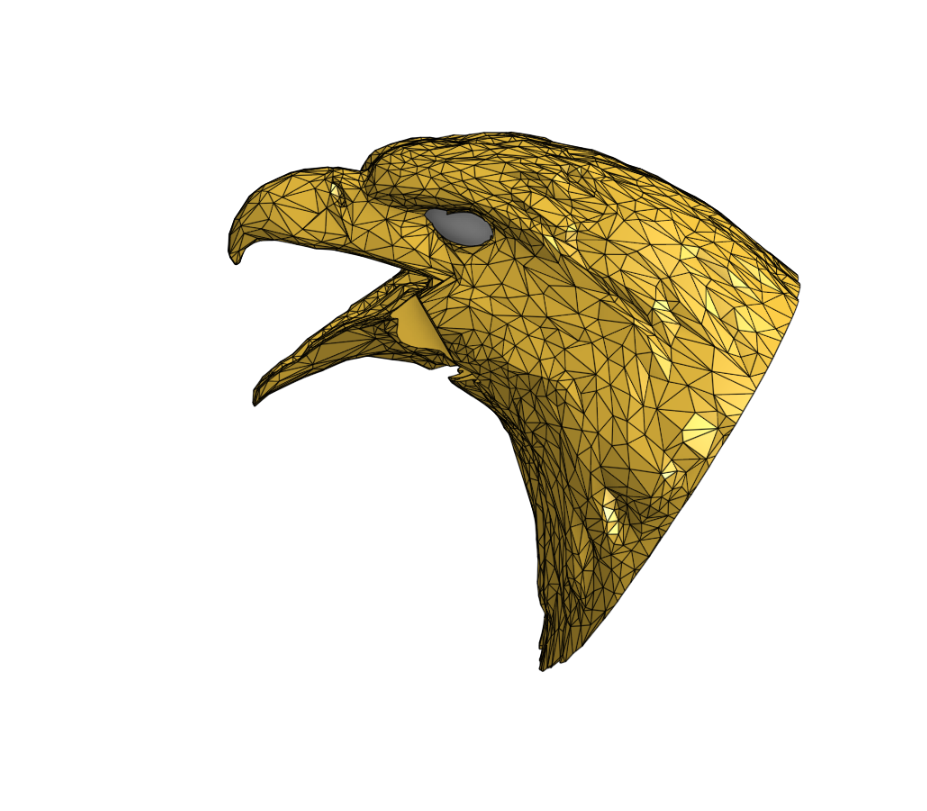
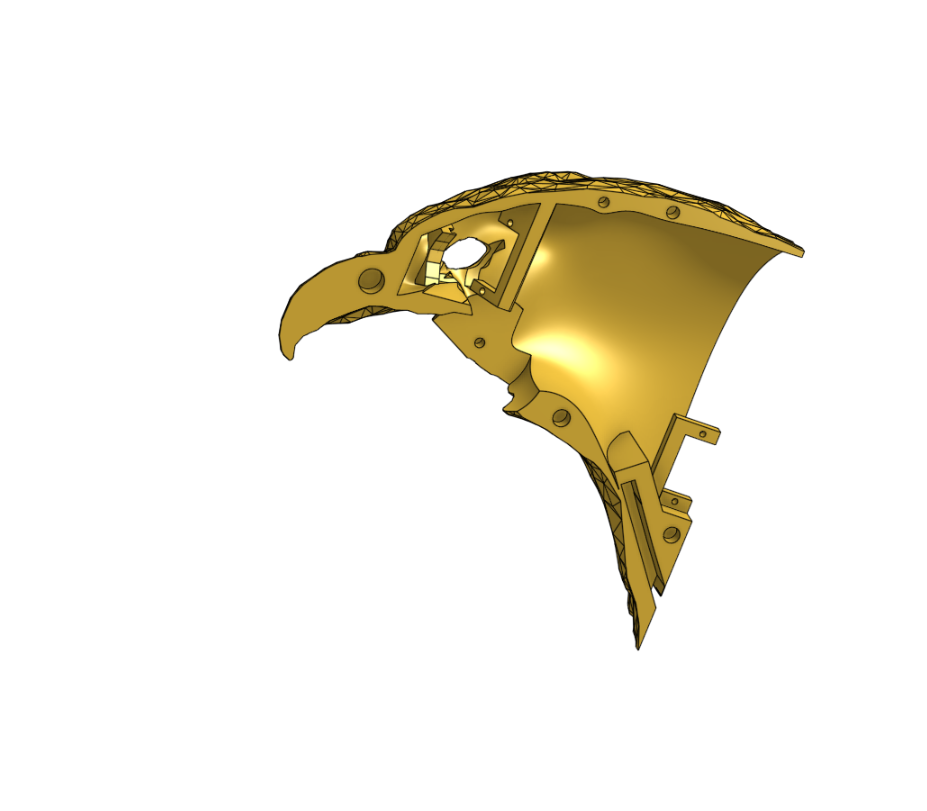
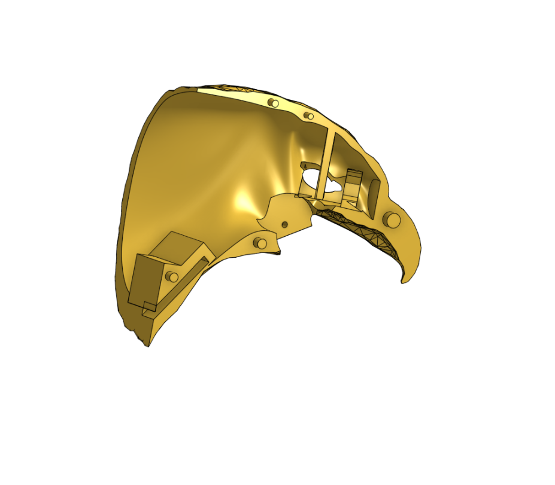
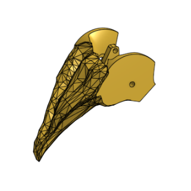
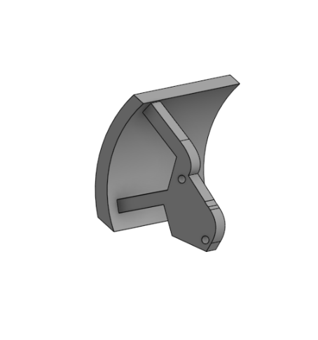
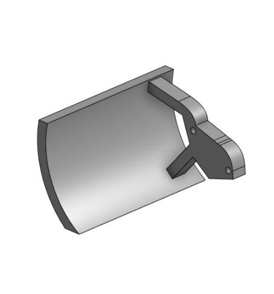
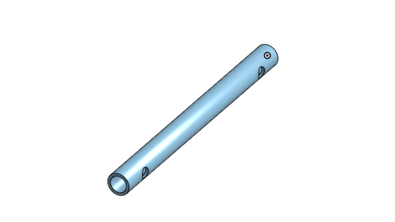

<h1 align="center"> DEA : Dynamic Eagle Animatronic</h1>

An english version of this README file can be found below the french one

<h2 align="center">Préambule</h2>
Depuis la Grêce antique et le mythe du géant de bronze Talos, les hommes ont toujours cherchés à créer des automates avec les moyens à leur disposition. Les animatroniques sont l'achèvement actuel de ce désir. Ce sont des poupées mécaniques plus ou moins réalistes dont le fonctionnement interne fait intervenir autant la mécanique que l'électronique.
Elles sont, depuis plusieurs décennies, et encore aujourd'hui principalement utilisées dans le domaine du divertissement au travers des parcs d'attractions, des films et des séries.

Dans le cadre d'un projet de deuxième année à l'école d'ingénieur française ENSEA ( École Nationale Supérieure de l'Électronique et de ses Applications), nous allons continuer la création d'une animatronique d'aigle royal démarrée au second semestre de l'année dernière.

# Sommaire 
  * #### Équipe et détail des tâches
  * #### Électronique et CAO
  * #### Modélisation & Impression 3D
  * #### Mécanique
  * #### Informatique
  * #### Résultat final
  * #### Points d'amélioration
  * #### Conclusion

<table>
  <tr>
    <td></td>
    <td></td>
  </tr>
</table>

<h1 align="center">Équipe</h1>

Membres de l'équipe : 
* #### Vincent Fernandes
    * [Github](https://github.com/FernandesVincent)
    * [Linkedin](https://www.linkedin.com/in/vincent-fernandes-0981552a6/)
* #### Maël Lukas
    * [Github](https://github.com/mael-lukas)
    * [Linkedin](https://www.linkedin.com/in/mael-lukas/)
* ##### Romane Ponthieu
    * [Github](https://github.com/Romanepnth)
    * [Linkedin](https://www.linkedin.com/in/romane-ponthieu/)
* #### Sedrenn Labrousse
    * [Github](https://github.com/Sedrennl)
    * [Linkedin](https://www.linkedin.com/in/sédrenn-labrousse-24b2a5295/)

* #### Supervisé par Nicolas Papazoglou
    * [Github](https://github.com/DBXYD?tab=overview&from=2024-05-01&to=2024-05-29)
    * [Linkedin](https://www.linkedin.com/in/nicolas-papazoglou-38382646/?originalSubdomain=fr)
 
* #### Supervisé par Laurent Fiack
    * [Github](https://github.com/lfiack)
    * [Linkedin](https://fr.linkedin.com/in/laurent-fiack-1b1415124)

Nous vous invitons à consulter notre [github de l'année dernière](https://github.com/mael-lukas/2324_Projet1AB_Animatronic), dans lequel vous pourrez trouver toutes les bases sur lesquelles nous avons démarré ce projet.

Ce projet s'articule autour de plusieurs compétences techniques : informatique, électronique & CAO, modélisation & impression 3D et mécanique. Chacune ayant partagée entre différents membres de l'équipe.

   * Informatique

Cette partie a été majoritairement traitée par Maël avec également, de manière plus minoritaire, Vincent.
Dans cette partie nous allons voir comment tout le code nécessaire au bon fonctionnement du DEA se présente. En partant de simple envoies de PWM pour commander des servomoteurs à la programmation de moteurs plus complexes, en passant par l'allumage de LED neopxiel et de la communication Bluetooth.

   * Électronique & CAO

Cette partie concerne différentes sous compétences : la conception des PCB, la soudure de ceux-ci, les test associés et finalement le sertissage et cablâge. 
Comme notre projet inclus plusieurs PCBs, leur conception a été réalisée par Vincent (pour les PCBs du corps et du gant) et Romane (pour le PCB de la tête).
Les soudures CMS ont été réalisées par Maël et Romane, tandis que les soudures THT ont été effectuées par Vincent.
Le sertissage et le cablâge ont également été réalisé par Vincent.

   * Modélisation & Impression 3D

Cette partie a été essentiellement traitée par Sedrenn aidée de Romane et Vincent. L'objectif de celle-ci étant de modéliser et d'imprimer l'aigle en taille 1:1 ainsi que des caches pour protéger l'alimentation et les PCBs.

   * Mécanique

Cette partie concerne la gestion des différents moteurs qui a été faite par Maël pour l'implémentation du code, par Vincent pour le cablâge de ceux-ci et leur placement sur la structure de l'aigle mais également par Sedrenn et Romane pour la conception des pièces 3D permettant de faire les liaisons entre ceux-ci.

<h1 align="center">Électronique & CAO</h1>

Pour commencer, veuillez trouver ci-dessous le diagramme d'architecture qui nous a servis de base pour la création des PCB de ce projet:

  

Voici donc, le schematic et le routage du PCB principal de projet, le PCB du corps :

<table>
  <tr>
    <td></td>
    <td></td>
  </tr>
</table>

Ce PCB a eu le droit à plusieurs versions afin de l'améliorer à chaque ittération. La dernière en date est l'ajout de R1, une résistance de pull-up pour le protocol UART qui nous sert à commander les moteurs. Cependant, une fois ce nouveau PCB soudé et testé nous n'arrivions plus à communiquer avec les moteurs donc nous sommes repassé sur la version antérieure du PCB, qui elle est foncitonnel, où la résistance de pull-up est activée sur STM32CubeIDE.
Vous pouvez trouvez [ici](https://github.com/mael-lukas/2425_Projet2A_Animatronic/blob/main/Hardware/pcb/Body/ProjetCorps.csv)la BOM de ce PCB.

Le second PCB que nous avons du réalisé est celui de la tête, vous constaterez qu'il n'a pas changé depuis [l'année dernière](https://github.com/mael-lukas/2324_Projet1AB_Animatronic) voici donc simplement son schematic, son routage et sa BOM :

<table>
  <tr>
    <td></td>
    <td></td>
  </tr>
</table>

[BOM](https://github.com/mael-lukas/2425_Projet2A_Animatronic/blob/main/Hardware/pcb/Head/bom%20t%C3%AAte)

Il est à noter qu'avec plus de temps nous aurions suremenent modifier ce PCB car les besoins de notre projet ont changés, nous n'avons plus besoin de contrôler six servomoteurs mais par contre nous avons besoin d'une piste GPIO pour contrôler l'état haut ou bas de la pin XSDN du [TOF](https://github.com/mael-lukas/2425_Projet2A_Animatronic/blob/main/Datasheets/vl53l1x-satel.pdf).

Le troisième et dernier PCB de projet est le PCB du gant qui se présente comme suit :

<table>
  <tr>
    <td></td>
    <td></td>
  </tr>
</table>

[BOM](https://github.com/mael-lukas/2425_Projet2A_Animatronic/blob/main/Hardware/pcb/Gant/PCB_Gant/PCB_Gant.csv)

L'objectif avec ce PCB est de pouvoir commander les mouvements de l'aigle avec les mouvements de nos doigts et ce sans liaison filaire mais avec une liaison bluetooth grâce au module [HC05](https://github.com/mael-lukas/2425_Projet2A_Animatronic/blob/main/Datasheets/HC-05%20Datasheet.pdf). Les empreintes de résistances en 1206 correspondent aux pads des [flex sensors](https://github.com/mael-lukas/2425_Projet2A_Animatronic/blob/main/Datasheets/Flex_Sensor_Datasheet_v2019a-3304101.pdf) qui sont des résistances variables qui nous permmettent grâce aux circuits visibles sur le schematic d'avoir une tension seuil à partir de laquelle on peut activer tel ou tel mouvement de l'aigle.
Pour pouvoir fonctionner via une liaison Bluetooth nous alimentons le PCB grâce à une batterie Li-ion 1S et grâce à un module servant de Boost pour pouvoir amener une tension de +5V au pcb.

Ce PCB pourrait avoir des versions plus évoluées notamment vis à vis des circuits des [flex sensors](https://github.com/mael-lukas/2425_Projet2A_Animatronic/blob/main/Datasheets/Flex_Sensor_Datasheet_v2019a-3304101.pdf) qui peuvent être largement améliorer afin de par exemple pouvoir changer la tension seuil désirée avec des potentiomètres à la place des résistances.

Ce PCB permet également le contrôle du volume du haut parleur grâce à l'encodeur rotatif présent dessus. Pour revenir rapidement sur cette partie "haut parleur", l'objectif est de pouvoir jouer des sons grâce à un haut parleur présents entre les pattes de l'aigle en fonction de la distance avec la personne en face de lui grâce au [TOF](https://github.com/mael-lukas/2425_Projet2A_Animatronic/blob/main/Datasheets/vl53l1x-satel.pdf).Par exemple, si je me trouve à un mètre de l'oiseau il me dira "Bonjour" par contre si je m'approche à dix centimètres de celui-ci il me dira "Recule".

Pour finir cette partie, vous pouvez voir ci-dessous quelques photos des PCB réaliés. Vous constaterez qu'ils sont chacun entourés d'un support fait en impression 3D. Ces supports ne sont pas nécessaire in fine mais ils permettent d'éviter les risques en empéchant les collisions malheureuses entre les PCB, ce qui pourrait amener des problèmes si cela se passe lorsqu'ils sont en fonctionnement.

<h1 align="center">Modélisation & Impression 3D</h1>

Maintenant que nous avons commencé à parler de modélisation 3D il est temps d'attaquer totalement cette partie. En effet, nous avons décidés d'imprimer l'aigle entièrement en 3D en le vidant bien sûr à l'intérieur afin de pouvoir y placer notre matériel. Nous avons séparés cette modélisation en 3 parties : la tête, les ailes et le reste.

## Tête
C'est sans aucun doute la partie la plus compliquée de cette modélisation car il faut la travailler pour faire en sorte que le bec et les paupières de l'aigle soit amovibles et contrôlables par des servomoteurs. Voici, ci-dessous le modèle 3D et l'impression de celle-ci.

<table>
  <tr>
    <td></td>
    <td></td>
  </tr>
</table>

Le modèle 3D a été repris d'un modèle existant, puis il a du être modifié afin notamment de vider l'intérieur, pour permettre le placement des moteurs, mais aussi de rendre la bouche et les paupières ammovibles.

<table>
  <tr>
    <td></td>
    <td></td>
  </tr>
</table>

<table>
  <tr>
    <td></td>
    <td></td>
    <td></td>
  </tr>
</table>

## Ailes
À l'opposé de la tête, c'est la modééisation la plus simple de projet car elle consiste seulement en la réalisation de pièces permettant d'approximer les os de l'aigle avec des emplacements pour les moteurs de l'épaule et du coude. À cela il faut ajouter les modules rouges que vous pourrez voir ci-après qui permettent la pose des plumes.

<table>
  <tr>
    <td></td>
    <td></td>
    <td></td>
  </tr>
</table>

<table>
 <tr>
    <td></td>
    <td></td>
    <td></td>
 </tr>
</table>

## Corps
Au vu du temps disponible, nous avons juste eu le temps de travailler la cage toracique de l'oiseau et donc nous avons délaissé la queue et les pattes qui n'ont pas d'autres utilités à part apporter de l'esthétique au projet, là où l'abdomen possède, lui, un réel intérêt. En effet, il nous permet de ranger à l'intérieur l'ensemble de notre électronique et de notre câblage afin que le projet ne laisse, dans l'idéal, rien apparaître de l'extérieur si tenté un câble d'alimentation.

<table>
  <tr>
    <td></td>
    <td></td>
  </tr>
</table>

L'impression du corps à due se faire en quatres parties car nous avions une coontrainte de temps : les impressiosns ne peuvent pas durer plus de 12h et les dimensions des imprimantes 3D qui sont trop petites pour notre modélisation. En effet, les plus grandes imprimantes 3D que nous pssédons sont des Creality K1 Max qui permettent de réaliser des impressions en 300x300x300 or le corps de l'oiseau tend plutôt sur du 350x400x200. De plus, pour l'assemblage de ces quatres parties, au vu du temps mis à disposition pour ce projet nous n'avons pas pu prévoir de moyen d'emboîter et de désemboiter cette partie. Pour que le tout se tienne nous avons donc pris le partit de coller les différentes parties avec un pistolet à colle.

<h1 align="center">Mécanique</h1>

Nous avons rapidement abordé la question des moteurs dans la partie précédente mais pour l'aborder un peu plus en profondeur, nous utilisons deux références de moteurs pour ce projet, les FS90 et les XL430. Les premiers sont des servomteur 180° permettant le choix d'une position sur un plage de 180° par l'envoi d'une PWM. Nous les utilisons pour commander le bec et les yeux de l'aigle car cela ne requiert que par de force. De l'autre côté, les XL430 nous servent pour les mouvement plus complexes et surtout qui demandent plus de force. En effet, nous utilisons six de ces moteurs pour réaliser les ailes de l'oiseau, sur chaque aile nous avons deux XL430 qui sont utilisés pour reproduire l'épaule et le troisième pour reproduire ce que nous pourrions appeler le coude. 

Vous l'avez peut-être remarquez sur les photos ci-dessus mais toutes les pièces liants les XL430 ont été réalisées en impression 3D à l'exceptio de la pièce liant les deux moteurs de l'épaule. En effet, nous avions également fait une première version de cette pièce en impression 3D mais le problème était qu'elle doit pouvoir soutenir tout le poids de l'aile. Cela a causé la destruction de la version 3D de la pièce lorsqu'i fallut tester les mouvements de l'aile. Pour pallier à cela nous avons commander la pièce en métal aurpès du fournisseur et c'est donc cette pièce que vous pouvez voir sur les photos.

<h1 align="center">Informatique</h1>

Cependant, tout cela ne pourrait pas fonctionner sans code. Voici, ci-dessous le diagramme d'architecture du code:

Nous allons traiter chaque partie de code de gauche à droite d'après ce diagramme en commençant tout d'abord par le code pour la communication bluetooth entre le STM32G474RET6 et le STM32G431KBT6.

Il faut cependant noter que nous n'avons cependant pas eu le temps de le tester correctement.

Pour le code du TOF, cette partie a été particulièrement compliquée pour nous et avions finis par la laisser un peu de côté au profit d'autres parties mais finalement nous avons pu avoir accès à une librairie écrite par M. Fiack et disponible sur son github. En adaptant cette librairie au processeur que nous utilisons nous avons pu faire fonctionner le TOF correctement. 

Les XL4430 sont sans aucun doute la partie la plus complexe de tout le projet, même au bout de tant de temps à travailler dessus nous avons toujours des problèmes dont nous ne comprenons pas la présence. En particulier, lorsque l'exact même code fonctionnait une semaine auparavant.

Les LED neopixel sont quant à elles une partie assez simple que nous avions réussi à faire fonctionner par l'envoi de PWM avant de passer à une version plus avancée grâce à une librairie de M. Fiack qui utilise le DMA.

Finalement, le code du module est surement la partie qui nous a été le plus simple à réalisée et qui nous permet, avec le module suivant : https://www.gotronic.fr/art-module-mp3-uart-mp3player-38215.htm de pouvoir jouer n'importe quel son présent sur la carte micro SD.

<h1 align="center">Résultat final</h1>
 
<h1 align="center">Points d'amélioration</h1>
 
<h1 align="center">Conclusion</h1>

************************************************************************************************************************************************************************************

<h1 align="center">ENGLISH VERSION</h1>

************************************************************************************************************************************************************************************
