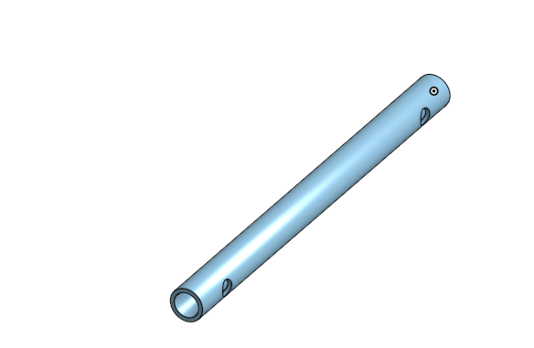

# 2425_Projet2A_Animatronic
Projet ENSEA 2A Animatronic

# DEA : Dynamic Eagle Animatronic

Depuis la Grêce antique et le mythe du géant de bronze Talos, les hommes ont toujours cherchés à créer des automates avec les moyens à leur disposition. Les animatroniques sont l'achèvement actuel de ce désir. Ce sont des poupées mécaniques plus ou moins réalistes dont le fonctionnement interne fait intervenir autant la mécanique que l'électronique.
Elles sont, depuis plusieurs décennies, et encore aujourd'hui principalement utilisées dans le domaine du divertissement au travers des parcs d'attractions, des films et des séries.

Dans le cadre d'un projet de deuxième année à l'école d'ingénieur ENSEA,  nous allons continuer une animatronique d'aigle. Cela sera supervisé par [M.Papazoglou](https://github.com/DBXYD?tab=overview&from=2024-05-01&to=2024-05-29) et [M.Fiack](https://github.com/lfiack).

<table>
  <tr>
    <td></td>
    <td></td>
  </tr>
</table>

# Equipe
Membres de l'équipe : 
* #### Vincent Fernandes
    * [Github](https://github.com/FernandesVincent)
    * [Linkedin](https://www.linkedin.com/in/vincent-fernandes-0981552a6/)
* #### Maël Lukas
    * [Github](https://github.com/mael-lukas)
    * [Linkedin](https://www.linkedin.com/in/mael-lukas/)
* ##### Romane Ponthieu
    * [Github](https://github.com/Romanepnth)
    * [Linkedin](https://www.linkedin.com/in/romane-ponthieu/)
* #### Sedrenn Labrousse
    * [Github](https://github.com/Sedrennl)
    * [Linkedin](https://www.linkedin.com/in/sédrenn-labrousse-24b2a5295/)

* #### Supervisé par Nicolas Papazoglou
    * [Github](https://github.com/DBXYD?tab=overview&from=2024-05-01&to=2024-05-29)
    * [Linkedin](https://www.linkedin.com/in/nicolas-papazoglou-38382646/?originalSubdomain=fr)
 
* #### Supervisé par Laurent Fiack
    * [Github](https://github.com/lfiack)
    * [Linkedin](https://fr.linkedin.com/in/laurent-fiack-1b1415124)

Nous vous invitons à consulter notre [github de l'année dernière](https://github.com/mael-lukas/2324_Projet1AB_Animatronic), dans lequel vous pourrez trouver toutes les bases sur lesquelles nous avons démarré ce projet.

Ce projet s'articule autour de plusieurs compétences techniques : informatique, électronique & CAO, modélisation & impression 3D et mécanique.

## Informatique

Cette partie a été majoritairement traitée par Maël avec également, de manière plus minoritaire, Vincent.
Dans cette partie nous allons voir comment tout le code nécessaire au bon fonctionnement du DEA se présente.

## Électronique & CAO

Cette partie concerne différentes sous compétences : la conception des PCB et la soudure de ceux-ci, les test associés et finalement le cablâge. 
Comme notre projet inclus plusieurs PCB, la conception des PCB a été faite par Vincent (PCB du corps et du gant) et Romane (PCB de la tête).
Les soudures CMS ont été réalisées par Maël et Romane, tandis que les soudures THT ont été réalisées par Vincent.
Le cablâge (sertissage) a été réalisé par Vincent.

## Modélisation & Impression 3D

Cette partie a été essentiellement traitée par Sedrenn aidée de Romane et Vincent. L'objectif de celle-ci étant de modéliser et d'imprimer l'aigle en taille 1:1 ainsi que des caches pour protéger l'alimentation et les PCBs.

## Mécanique

Cette partie concerne la gestion des différents moteurs qui a été faite par Maël pour l'implémentation du code, par Vincent pour le cablâge de ceux-ci et leur placement sur la structure de l'aigle mais également par Sedrenn et Romane pour la conception des pièces 3D permettant de faire les liaisons entre ceux ci.

# Électronique & CAO

Pour commencer, veuillez trouver ci-dessous le diagramme d'architecture qui nous a servis de base pour la création des PCB de ce projet:

<table>
  <tr>
    <td></td>
  </tr>
</table>

Voici donc, le schematic et le routage du PCB principal de projet, le PCB du corps :

<table>
  <tr>
    <td></td>
    <td></td>
  </tr>
</table>

Ce PCB a eu le droit à plusieurs versions afin de l'améliorer à chaque ittération. La dernière en date est l'ajout de R1, une résistance de pull-up pour le protocol UART qui nous sert à commander les moteurs. Cependant, une fois ce nouveau PCB soudé et testé nous n'arrivions plus à communiquer avec les moteurs donc nous sommes repassé sur la version antérieure du PCB, qui elle est foncitonnel, où la résistance de pull-up est activée sur STM32CubeIDE.
Vous pouvez trouvez [ici](https://github.com/mael-lukas/2425_Projet2A_Animatronic/blob/main/Hardware/pcb/Body/ProjetCorps.csv)la BOM de ce PCB.

Le second PCB que nous avons du réalisé est celui de la tête, vous constaterez qu'il n'a pas changé depuis [l'année dernière](https://github.com/mael-lukas/2324_Projet1AB_Animatronic) voici donc simplement son schematic, son routage et sa BOM :

<table>
  <tr>
    <td></td>
    <td></td>
  </tr>
</table>

[BOM](https://github.com/mael-lukas/2425_Projet2A_Animatronic/blob/main/Hardware/pcb/Head/bom%20t%C3%AAte)

Il est à noter qu'avec plus de temps nous aurions suremenent modifier ce PCB car les besoins de notre projet ont changés, nous n'avons plus besoin de contrôler six servomoteurs mais par contre nous avons besoin d'une piste GPIO pour contrôler l'état haut ou bas de la pin XSDN du [TOF](https://github.com/mael-lukas/2425_Projet2A_Animatronic/blob/main/Datasheets/vl53l1x-satel.pdf).

Le troisième et dernier PCB de projet est le PCB du gant qui se présente comme suit :

<table>
  <tr>
    <td></td>
    <td></td>
  </tr>
</table>

[BOM](https://github.com/mael-lukas/2425_Projet2A_Animatronic/blob/main/Hardware/pcb/Gant/PCB_Gant/PCB_Gant.csv)

L'objectif avec ce PCB est de pouvoir commander les mouvements de l'aigle avec les mouvements de nos doigts et ce sans liaison filaire mais avec une liaison bluetooth grâce au module [HC05](https://github.com/mael-lukas/2425_Projet2A_Animatronic/blob/main/Datasheets/HC-05%20Datasheet.pdf). Les empreintes de résistances en 1206 correspondent aux pads des [flex sensors](https://github.com/mael-lukas/2425_Projet2A_Animatronic/blob/main/Datasheets/Flex_Sensor_Datasheet_v2019a-3304101.pdf) qui sont des résistances variables qui nous permmettent grâce aux circuits visibles sur le schematic d'avoir une tension seuil à partir de laquelle on peut activer tel ou tel mouvement de l'aigle.
Pour pouvoir fonctionner via une liaison Bluetooth nous alimentons le PCB grâce à une batterie Li-ion 1S et grâce à un module servant de Boost pour pouvoir amener une tension de +5V au pcb.

Ce PCB pourrait avoir des versions plus évoluées notamment vis à vis des circuits des flex sensors qui peuvent être largement améliorer afin de par exemple pouvoir changer la tension seuil désirée avec des potentiomètres à la place des résistances.

Ce PCB permet également le contrôle du volume du haut parleur grâce à l'encodeur rotatif présent dessus. Pour revenir rapidement sur cette partie "haut parleur", l'objectif est de pouvoir jouer des sons grâce à un haut parleur présents entre les pattes de l'aigle en fonction de la distance avec la personne en face de lui grâce au [TOF](https://github.com/mael-lukas/2425_Projet2A_Animatronic/blob/main/Datasheets/vl53l1x-satel.pdf).Par exemple, si je me trouve à un mètre de l'oiseau il me dira "Bonjour" par contre si je m'approche à dix centimètres de celui-ci il me dira "Recule".

Pour finir cette partie, vous pouvez voir ci-dessous quelques photos des PCB réaliés. Vous constaterez qu'ils sont chacun entourés d'un support fait en impression 3D. Ces supports ne sont pas nécessaire in fine mais ils permettent d'éviter les risques en empéchant les collisions malheureuses entre les PCB, ce qui pourrait amener des problèmes si cela se passe lorsqu'ils sont en fonctionnement.

Maintenant que nous avons commencé à parler de modélisation 3D il est temps d'attaquer totalement cette partie. En effet, nous avons décidés d'imprimer l'aigle entièrement en 3D en le vidant bien sûr à l'intérieur afin de pouvoir y placer notre matériel. Nous avons séparés cette modélisation en 3 parties : la tête, les ailes et le reste.

Tout d'abord, la tête:
C'est sans aucun doute la partie la plus compliquée de cette modélisation car il faut la travailler pour faire en sorte que le bec et les paupières de l'aigle soit amovibles et contrôlables par des servomoteurs. Voici, ci-dessous les modèles 3D et l'impression de celle-ci.

Pour continuer, les ailes: 
À l'opposé de la tête, c'est la modééisation la plus simple de projet car elle consiste seulement en la réalisation de pièces permettant d'approximer les os de l'aigle avec des emplacements pour les moteurs de l'épaule et du coude. À cela il faut ajouter les modules rouges que vous pourrez voir ci-après qui permettent la pose des plumes.

Pour finir, le corps:
Au vu du temps disponible, nous avons juste eu le temps de travailler la cage toracique de l'oiseau et donc nous avons délaissé la queue et les pattes qui n'ont pas d'autres utilités à part apporter de l'esthétique au projet, là où l'abdomen possède, lui, un réel intérêt. En effet, il nous permet de ranger à l'intérieur l'ensemble de notre électronique et de notre câblage afin que le projet ne laisse, dans l'idéal, rien apparaître de l'extérieur si tenté un câble d'alimentation.

La modélisation du courps à du se faire en quatres parties car nous avions une coontrainte de temps : les impressiosns ne peuvent pas durer plus de 12h et les dimensions des imprimantes 3D qui sont trop petites pour notre modélisation. En effet, les plus grandes imprimantes 3D que nous pssédons sont des Creality K1 Max qui permettent de réaliser des impressions en 300x300x300 or le corps de l'oiseau tend plutôt sur du 350x400x200. De plus, pour l'assemblage de ces quatres parties, au vu du temps mis à disposition pour ce projet nous n'avons pas pu prévoir de moyen d'emboîter et de désemboiter cette partie. Pour que le tout se tienne nous avons donc pris le partit de souder entre eux les morceaux de PLA une fois imprimés.

Nous avons rapidement abordé la question des moteurs dans la partie précédente mais pour l'aborder un peu plus en profondeur, nous utilisons deux références de moteurs pour ce projet, les FS90 et les XL430. Les premiers sont des servomteur 180° permettant le choix d'une position sur un plage de 180° par l'envoi d'une PWM. Nous les utilisons pour commander le bec et les yeux de l'aigle car cela ne requiert que par de force. De l'autre côté, les XL430 nous servent pour les mouvement plus complexes et surtout qui demandent plus de force. En effet, nous utilisons six de ces moteurs pour réaliser les ailes de l'oiseau, sur chaque aile nous avons deux XL430 qui sont utilisés pour reproduire l'épaule et le troisième pour reproduire ce que nous pourrions appeler le coude. 

Vous l'avez peut-être remarquez sur les photos ci-dessus mais toutes les pièces liants les XL430 ont été réalisées en impression 3D à l'exceptio de la pièce liant les deux moteurs de l'épaule. En effet, nous avions également fait une première version de cette pièce en impression 3D mais le problème était qu'elle doit pouvoir soutenir tout le poids de l'aile. Cela a causé la destruction de la version 3D de la pièce lorsqu'i fallut tester les mouvements de l'aile. Pour pallier à cela nous avons commander la pièce en métal aurpès du fournisseur et c'est donc cette pièce que vous pouvez voir sur les photos.

Cependant, tout cela ne pourrait pas fonctionner sans code. Voici, ci-dessous le diagramme d'architecture du code:

Nous allons traiter chaque partie de code de gauche à droite d'après ce diagramme en commençant tout d'abord par le code pour la communication bluetooth entre le STM32G474RET6 et le STM32G431KBT6.

Il faut cependant noter que nous n'avons cependant pas eu le temps de le tester correctement.

Pour le code du TOF, cette partie a été particulièrement compliquée pour nous et avions finis par la laisser un peu de côté au profit d'autres parties mais finalement nous avons pu avoir accès à une librairie écrite par M. Fiack et disponible sur son github. En adaptant cette librairie au processeur que nous utilisons nous avons pu faire fonctionner le TOF correctement. 

Les XL4430 sont sans aucun doute la partie la plus complexe de tout le projet, même au bout de tant de temps à travailler dessus nous avons toujours des problèmes dont nous ne comprenons pas la présence. En particulier, lorsque l'exact même code fonctionnait une semaine auparavant.

Les LED neopixel sont quant à elles une partie assez simple que nous avions réussi à faire fonctionner par l'envoi de PWM avant de passer à une version plus avancée grâce à une librairie de M. Fiack qui utilise le DMA.

Finalement, le code du module est surement la partie qui nous a été le plus simple à réalisée et qui nous permet, avec le module suivant : https://www.gotronic.fr/art-module-mp3-uart-mp3player-38215.htm de pouvoir jouer n'importe quel son présent sur la carte micro SD.

# Journal de bord

## Séance 1
   Cette séance étant la première, elle nous a servit à définir les nouveaux objectifs de notre projet : nous voulons finaliser complètement notre aigle, c'est-à-dire finir la modélisation 3D, et finir le code. De plus, nous voulons ajouter des nouvelles fonctionnalités à notre aigle : nous voulons le faire crier en fonction de la distance de l'utilisateur, et nous voulons qu'il s'illumine. Pour y voir plus clair, nous avons effectué une première version du diagramme d'architecture. Afin de nous organiser au mieux au vu du temps disponible pour ce projet, nous nous sommes directement répartit différentes tâches à réaliser durant les semaines qui suivent.
   * #### Modélisation 3D de l'aigle
        * [Sedrenn](https://github.com/mael-lukas/2324_Projet1AB_Animatronic/tree/main?tab=readme-ov-file#sedrenn-labrousse)
   * #### Programmation 
        * [Maël](https://github.com/mael-lukas/2324_Projet1AB_Animatronic/tree/main?tab=readme-ov-file#ma%C3%ABl-lukas)
   * #### Conception des différents PCB
        * [Romane](https://github.com/mael-lukas/2324_Projet1AB_Animatronic/tree/main?tab=readme-ov-file#romane-ponthieu)
        * [Vincent](https://github.com/mael-lukas/2324_Projet1AB_Animatronic/tree/main?tab=readme-ov-file#vincent-fernandes)
    

## Séance 2
   Durant cette séance nous avons affiné notre diagramme d'architecture.

   Nous avons repris les PCB que nous avions conçus l'année dernière, nous en avions 3. Nous avons commencé à chercher aux solutions que nous allons utiliser pour pouvoir effectuer toutes les fonctionnalités que nous voulons avec notre aigle. Nous avons cherché les composants dont nous allons avoir besoin par la suite afin d'effectuer une commande pour tous les composants dont nous ne disposons pas à l'école. 
   Pendant ce temps, [Sedrenn](https://github.com/mael-lukas/2324_Projet1AB_Animatronic/tree/main?tab=readme-ov-file#sedrenn-labrousse) a avancé sur la modélisation 3D et [Maël](https://github.com/mael-lukas/2324_Projet1AB_Animatronic/tree/main?tab=readme-ov-file#ma%C3%ABl-lukas) a continué le code qu'il avait commencé l'année dernière.

   
## Séance 3
   À cette étape du projet nous avons choisis de changer de microprocesseur, afin d'en utiliser un ayant assez de PIN pour effectuer toutes les fonctionnalités que nous souhaitons. Nous avons donc commencé à concevoir les nouveaux PCB dont nous allons avoir besoin en fonction de ce microprocesseur.
  En parallèle de cela, [Maël](https://github.com/mael-lukas/2324_Projet1AB_Animatronic/tree/main?tab=readme-ov-file#ma%C3%ABl-lukas) a continué le code des moteurs qu'il avait commencé et [Sedrenn](https://github.com/mael-lukas/2324_Projet1AB_Animatronic/tree/main?tab=readme-ov-file#sedrenn-labrousse) a commencé à concevoir le squelette de l'animatronic.

   
## Séance 4
   Cette séance a permis la finalisation des schematic des 3 [PCB](https://github.com/mael-lukas/2324_Projet1AB_Animatronic?tab=readme-ov-file#pcb) crées sous Kicad et ainsi le passage à l'étape PCB editor pour les membres affectés à cette partie du projet.
   Pendant ce temps [Maël](https://github.com/mael-lukas/2324_Projet1AB_Animatronic/tree/main?tab=readme-ov-file#ma%C3%ABl-lukas) a finalisé une première version du code des moteurs XL430 et [Sedrenn](https://github.com/mael-lukas/2324_Projet1AB_Animatronic/tree/main?tab=readme-ov-file#sedrenn-labrousse) a continué de concevoir le squelette de l'aigle.

   
## Séance 5
   Durant cette séance, nous avons effectuer une première présentation du projet à nos professeurs, qui ont pu constater notre avancée et nous guider.
   Par la suite, M.Papazoglou et M. Fiack ont pu vérifier les 3 [PCB](https://github.com/mael-lukas/2324_Projet1AB_Animatronic?tab=readme-ov-file#pcb) et nous faire des retours pour que l'on puisse corriger nos erreurs et effectuer des nouvelles modifications.
   M. Fiack a aussi revu les codes des moteurs avec [Maël](https://github.com/mael-lukas/2324_Projet1AB_Animatronic/tree/main?tab=readme-ov-file#ma%C3%ABl-lukas) et il a pu corriger tous les problèmes qu'il rencontrait.
 Pendant cette séance, Sedrenn a pu finir le squelette de l'aigle.
   

## Séance 6
   Au cours de cette séance nous avons reçu les commandes de composants ainsi que les PCB.  [Vincent](https://github.com/mael-lukas/2324_Projet1AB_Animatronic/tree/main?tab=readme-ov-file#vincent-fernandes) et [Romane](https://github.com/mael-lukas/2324_Projet1AB_Animatronic/tree/main?tab=readme-ov-file#romane-ponthieu) ont donc pu soudé les PCB durant ces 4 heures.
   En parralèle à cela, [Sedrenn](https://github.com/mael-lukas/2324_Projet1AB_Animatronic/tree/main?tab=readme-ov-file#sedrenn-labrousse) a commencé à modéliser des liaisons permettant de fixer les moteurs qui vont faire bouger les ailes sur le squelette.
  [Maël](https://github.com/mael-lukas/2324_Projet1AB_Animatronic/tree/main?tab=readme-ov-file#ma%C3%ABl-lukas), quant à lui, a commencé le code permettant de programmer le ruban néopixel.

   
## Séance 7
   Au cours de cette séance, nous avons effectuer une deuxième présentation du projet à M. Papazoglou et M. Fiack, dans lequel nous avons fait un point sur ceque nous avions fini et cequ'il nous restait à faire. 
   Ensuite, [Romane](https://github.com/mael-lukas/2324_Projet1AB_Animatronic/tree/main?tab=readme-ov-file#romane-ponthieu) et [Vincent](https://github.com/mael-lukas/2324_Projet1AB_Animatronic/tree/main?tab=readme-ov-file#vincent-fernandes) se sont réorientés sur de nouveaux sujets : Romane va aider [Sedrenn](https://github.com/mael-lukas/2324_Projet1AB_Animatronic/tree/main?tab=readme-ov-file#sedrenn-labrousse) pour la modélisation 3D de l'aigle et Vincent va s'occuper du code du TOF.
   
   Pendant ce temps [Sedrenn](https://github.com/mael-lukas/2324_Projet1AB_Animatronic/tree/main?tab=readme-ov-file#sedrenn-labrousse) a imprimé une première liaison moteur-squelette et l'a testée par la suite. [Maël](https://github.com/mael-lukas/2324_Projet1AB_Animatronic/tree/main?tab=readme-ov-file#ma%C3%ABl-lukas) a continué le code du ruban néopixel, en effectuant des premiers tests.

<table>
  <tr>
    <td></td>
</table>

   
## Séance 8
   Au cours de cette séance, [Vincent](https://github.com/mael-lukas/2324_Projet1AB_Animatronic/tree/main?tab=readme-ov-file#vincent-fernandes) a continué le code permettant de faire fonctionner le TOF et [Maël](https://github.com/mael-lukas/2324_Projet1AB_Animatronic/tree/main?tab=readme-ov-file#ma%C3%ABl-lukas) l'a aidé avant de commencer l'écriture du code pour le module mp3. Ils ont pu commencé à tester le code du TOF.
   D'un autre côté, [Sedrenn](https://github.com/mael-lukas/2324_Projet1AB_Animatronic/tree/main?tab=readme-ov-file#sedrenn-labrousse) et [Romane](https://github.com/mael-lukas/2324_Projet1AB_Animatronic/tree/main?tab=readme-ov-file#romane-ponthieu) ont réfléchi à un mécanisme permettant d'effectuer les mouvements de l'aigle d'un aigle et elles sont arrivées au schéma ci-dessous.

 <table>
  <tr>
    <td></td>
  </tr>
</table>

   
## Séance 9
  Durant cette séance, [Sedrenn](https://github.com/mael-lukas/2324_Projet1AB_Animatronic/tree/main?tab=readme-ov-file#sedrenn-labrousse) et [Romane](https://github.com/mael-lukas/2324_Projet1AB_Animatronic/tree/main?tab=readme-ov-file#romane-ponthieu) ont modélisé chaque pièce permettant de concevoir l'articulation de l'aile de l'aigle. 
  Pendant ce temps, [Maël](https://github.com/mael-lukas/2324_Projet1AB_Animatronic/tree/main?tab=readme-ov-file#ma%C3%ABl-lukas) et [Vincent](https://github.com/mael-lukas/2324_Projet1AB_Animatronic/tree/main?tab=readme-ov-file#vincent-fernandes) ont pu faire fonctionner le TOF.

  
## Séance 10
   
   Au cours de cette séance, nous avons présenter notre avancement à M. Fiack et M. Papazoglou. 
   Ensuite, [Vincent](https://github.com/mael-lukas/2324_Projet1AB_Animatronic/tree/main?tab=readme-ov-file#vincent-fernandes) et [Maël](https://github.com/mael-lukas/2324_Projet1AB_Animatronic/tree/main?tab=readme-ov-file#ma%C3%ABl-lukas) ont pu continué de tester leur code respectif et les modifier en fonction des problèmes qu'ils rencontraient. 
   Pendant ce temps, [Sedrenn](https://github.com/mael-lukas/2324_Projet1AB_Animatronic/tree/main?tab=readme-ov-file#sedrenn-labrousse) et [Romane](https://github.com/mael-lukas/2324_Projet1AB_Animatronic/tree/main?tab=readme-ov-file#romane-ponthieu) ont continué de modéliser les pièces comprises dans l'articulation de l'aile de l'aigle.

<table>
  <tr>
    <td></td>
    <td></td>
    <td></td>
  </tr>
</table>

## Séance 11
   
   Au cours de cette dernière séance, [Vincent](https://github.com/mael-lukas/2324_Projet1AB_Animatronic/tree/main?tab=readme-ov-file#vincent-fernandes) et [Maël](https://github.com/mael-lukas/2324_Projet1AB_Animatronic/tree/main?tab=readme-ov-file#ma%C3%ABl-lukas) ont pu finalisé leurs codes et s'assuerer qu'ils fonctionnaient comme ils l'avaient prévus notamment le module MP3 qui, relié à un câble jack dénudé et serti pour s'adapter au connecteur de l'amplificateur du haut-parleur, a permis de jouer un son pré enregistré sur une micro carte SD.
   Pendant ce temps, [Sedrenn](https://github.com/mael-lukas/2324_Projet1AB_Animatronic/tree/main?tab=readme-ov-file#sedrenn-labrousse) et [Romane](https://github.com/mael-lukas/2324_Projet1AB_Animatronic/tree/main?tab=readme-ov-file#romane-ponthieu) ont terminé de modéliser les pièces comprises dans l'articulation de l'aile de l'aigle et ont pu commencéà les imprimer en 3D.

<table>
  <tr>
    <td></td>
    <td></td>
  </tr>
</table>

## Conclusion

   Pour conclure la première partie de ce projet, nous n'avons pas encore ce que nous espérons obtenir à la fin, mais nous nous en rapprochons. Chaque partie du projet a considérablement avancé, et certaines sont déjà finalisées, comme les PCB. Il ne nous manque plus que des détails, c'est-à-dire finaliser complètement les codes et effectuer l'assemblage mécanique de l'aigle. Après cela, nous pourrons relier chacune des parties de notre projet et voir si notre animatronique fonctionne comme nous l'avions prévu. Cette étape va être importante, et nous aurons sûrement de nouvelles modifications à effectuer au niveau du code et de la modélisation 3D. 
   L'ensemble du groupe est fier et heureux d'avoir réussi à avancer sur ce projet et il ne s'arrête pas ici puisque nous allons continuer de travailler sur celui-ci durant notre second semestre à l'école.
   Nous avons déjà des idées de projets annexes reliés à notre aigle, par exemple, nous aimerions concevoir un gant permettant de relier le mouvement d'une main d'un utilisateur à celui des ailes de l'aigle.
